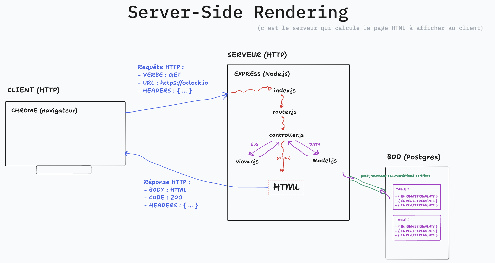
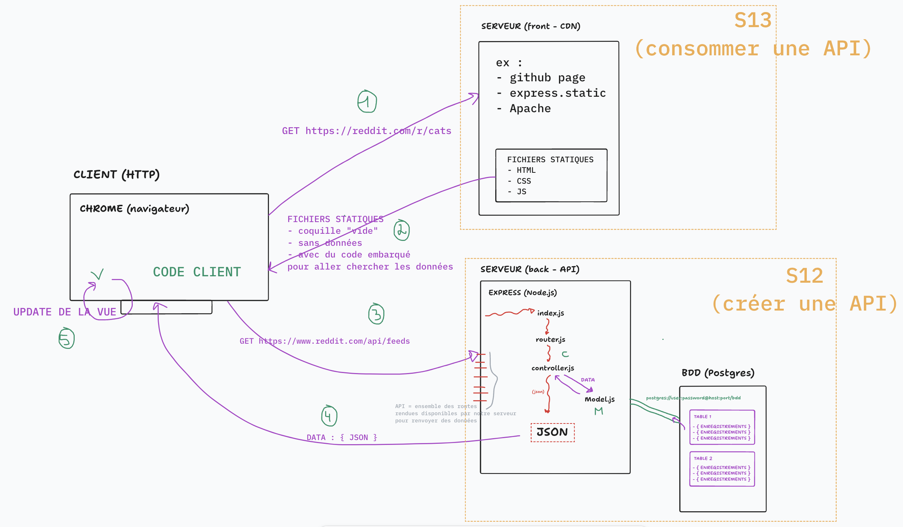

# JOUR 1 - API - Architecture client-serveur & Conception

## Menu du jour 

```
=== Matin COURS ===

- Architecture client-serveur (API & SPA)
- Découverte des API & Client HTTP
- Découverte AJAX (`fetch`)


=== Aprem ATELIER ===

- Gestion de projet
  - User stories
  - Wireframes

- Modélisation
  - MCD
  - MLD

- (Bonus) Base de données
  - Création de la base
  - Création des tables
  - Echantillonnage
```


## Architecture

### Server-side redering

Objectif : **le serveur renvoie du HTML construit côté serveur (à partir d'une vue + des données)**



**Avantages** :
- **Simplicité** : une seul serveur (backend) qui calcule la page HTML
- **SEO** : meilleur référencement car les données sont affichées sur la page

**Inconvénients** : 
- **SoC** : le backend s'occupe de l'affichage
- **Performance** : le backend doit "calculer" la page HTML, c'est une opération qui prends du temps (le temps du `res.render()`)
- **Dynamisme** : pour ré-actualiser les informations, il faut souvent recharger la page => nouvelle requête => prend du temps 
  - ex : quand on ajoutait un Level, on devait recharger toute la page pour afficher le nouveau Level.


### Architecture client-serveur

Objectif : 
- **le client demande du "code client" à un premier serveur** (coquille vide sans les données mais capable d'aller les chercher)
- le code client va chercher les données sur une API HTTP (une interface vers base de données).



**Avantages** :
- **Dynamisme** : on peut faire une requête depuis une page déjà ouverte et mettre à jour ensuite la vue !
  - ex : quand on arrive en bas de page sur Reddit, le code front va chercher de nouvelles données ET les affiches sans pour autant rafraichir la page. 
- **SoC** : 
  - on sépare la responsabilité de la gestion de la données (backend)
  - de la responsabilité de l'affichage de la donnée (frontend)
- **Clients multiples**
  - une fois qu'on a l'API, on peut ajouter de nouveau clients (Desktop, Browser, Mobile, Frigo-connecté)

**Inconvénients** : 
- **SEO** : le front nous renvoie une coquille VIDE, donc pas d'info à indexé 
  - => généralement, cette approche est utilisé pour des pages dynamiques que l'on n'indexe pas necessairement
- **Securité** : plus de considération à prendre en compte

## API

`API` = Application Programming **Interface** 
- terme très vaste qui de manière générale designe une INTERFACE
- une couche d'abstraction entre deux parties du code
- une ensemble de fonctions mis à disposition
- attention, sa signification change donc régulièrement avec le contexte

Exemple d'API : 
- `Math`
  - `Math.random()`
  - `Math.round()`
  - `Math.PI`
  - Ici, on parle de l'API de l'objet `Math`

- `Level`
  - `Level.findAll()`
  - `Level.findOne()`
  - `Level.create()`
  - Ici, on parle de l'API d'un Modèle `Sequelize`


## API (WEB) HTTP 

- Un ensemble de "routes" (endpoints, d'url) HTTP permettant de récupérer de la données
- En général, l'API est une couche qui sécurise la BDD et facilite l'accès à certaines ressources
- Si l'API renvoie du JSON, on parle souvent d'`API JSON`

Exemples : 

- **Open Food Fact** 
  - https://fr.openfoodfacts.org/data
    - ex : `GET https://world.openfoodfacts.org/api/v2/product/737628064502`
- **Pokeapi** 
  - https://pokeapi.co/
    - ex : `GET https://pokeapi.co/api/v2/pokemon/ditto`
    - ex : `GET https://pokeapi.co/api/v2/move/thunder`
- **Star wars**
  - https://swapi.dev/
    - ex : `GET https://swapi.dev/api/planets/1/`
- **OMDB** (Films)
  - https://www.omdbapi.com/
    - ex : `GET https://www.omdbapi.com/?s=harry&apikey=1e58f63b`
- **Geo gouv API**
  - https://geo.api.gouv.fr/decoupage-administratif
    - ex : `GET https://geo.api.gouv.fr/departements`

La liste précédente est une **liste d'API publique** pour que n'importe quel dev puisse y accéder.

Il existe des API privée, c'est à dire qui ont vocation à n'être requêter que par un client particulier (ex: le front de Oquiz)
- en général, on peut faire autre chose que de la lecture (ajouter un quiz dans l'API oquiz)
- en général, les routes sont protégés par un système d'authentification.

Il existe énormément d'API publique, par exemple :  https://github.com/public-api-lists/public-api-lists
- 99% des API publiques sont en [lecture seul (GET)](https://github.com/public-api-lists/public-api-lists?tab=readme-ov-file#animals) car sinon n'importe qui pourrait ajouter n'importe quoi !
- il existe aussi des API publiques mais payante (ex : `Clearbit`)


## Outils

Recommandation : installer [JSON Formatter sur Chrome](https://chromewebstore.google.com/detail/json-formatter/bcjindcccaagfpapjjmafapmmgkkhgoa).

