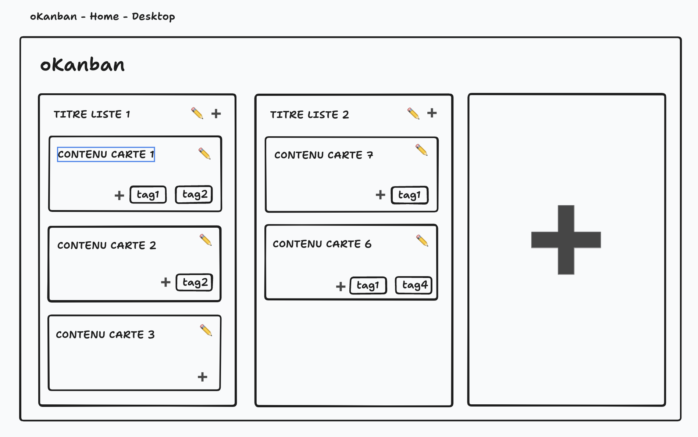
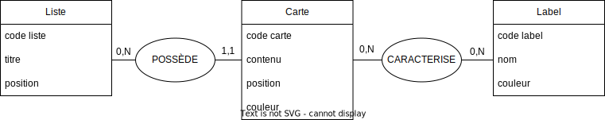
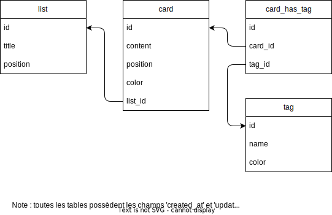

# JOUR 2 - API - Conception & Modèles

## Menu du jour

```
=== Matin COURS ===

- Correction (~1H40)
  - Gestion de projet (user stories/wireframes)
  - Modélisation (MCD/MLD)
  - BDD & Scripts SQL (DDL/DML)

- Architecture (~0H50)
  - Chores (package.json, ESLint, .env, .gitignore, ...)
  - ECMAScript Modules
  - Modèle Sequelize `List`
    - (bonus) Script JS de creation des tables (DDL)
    - (bonus) Script JS d'échantillonnage (DML)

- Gitflow (~0H15)
  - Mise en place

=== Aprem ATELIER ===

- Modèles Sequelize
  - Card
  - Tag
  - Associations

- Scripts
  - Compléter la création des tables en JS
  - Compléter l'échantillonnage en JS
  - Scripts NPM
```

## Clients HTTP

API HTTP (serveur) : 
- `https://dog.ceo/api/breeds/list/all` (JSON)
- `https://oclock.io` (HTML)

Clients HTTP :
- `curl <url>` dans le terminal
- `Chrome` en tapant l'`<url>` dans la barre d'URL
- `fetch(<url>)` en JavaScript
- `Insomnia` outil GUI (graphical user interface) pour tester

L'idée d'un client HTTP est de pouvoir tester une ce que revoie une API web.


## Wireframes (GDP)



Note : pensez au CRUD quand vous réalisé un wireframes. L'objectif de ce croquis est d'aider à comprendre comment l'utilisateur va intéragir avec le produit !

Note : on peut ajouter des wireframes pour les différents cas d'utilisation :
- version mobile
- version desktop
- version admin
- version "la modale d'ajout d'une nouvelle carte est ouverte"

Conseil : `TLDraw` ou `Excalidraw` pour les wireframes.


## User stories (GDP)

Formalisme : 
- `en tant que [role] je souhaite [action] ( afin de [but] )`
- `as a [role] I want to [action] (so that [goal] )`

Objectif : 
- clarifier les interactions de l'utilisateur
- => scenario de test pour notre application finale
- => permet de nous organiser sur la livraison des fonctionnalités
- => pensez au `CRUD` (CREATE READ UPDATE DELETE)
- => on en profite pour penser aux conséquences de certaines actions
- => aide à définir notre **MVP** = `Minimum Viable Product` (version 1)

Définir les rôles : 
- **Utilisateur** = notre visiteur (non loggé) unique qui visite le site web

| En tant que | Je souhaite                      | Afin de         | (bonus) Poker planning |
| ----------- | -------------------------------- | --------------- | ---------------------- |
| Utilisateur | accèder à la page d'accueil      | voir mon kanban | V1 (MVP)               |
| Utilisteur  | créer une nouvelle liste         |                 | V1                     |
| Utilisateur | modifier le titre d'une liste    |                 | V1                     |
| Utilisateur | supprimer une liste              |                 | V1                     |
| Utilisateur | ajouter une carte dans une liste |                 |                        |
| Utilisateur | modifier le contenu d'une carte  |                 |                        |
| Utilisateur | modifier la couleur d'une carte  |                 |                        |
| Utilisateur | supprimer une carte              |                 |                        |
| Utilisateur | créer un nouveau tag             |                 |                        |
| Utilisteur  | modifier le nom du tag           |                 |                        |
| Utilisteur  | modifier la couleur d'un tag     |                 |                        |
| Utilisateur | supprimer un tag                 |                 |                        |
| Utilisateur | ajouter un tag sur une carte     |                 |                        |
| Utilisateur | retirer un tag d'une carte       |                 |                        |


## MCD - Modèle Conceptuel de Données (MERISE)

Idée : 
- réfléchir à ce que l'on a besoin de stocker. 
- nommer les choses

Formalisme académique : 
- entités
- attributs
- cardinalité
- discriminant

Brouillon des entités et de leur attributs : 
- `liste (titre, #cartes, position)`
- `cartes (contenu, position, couleur, #labels)`
- `label (nom, couleur)`

Note : 
- l'association permet de representer le lien entre deux entités
- on n'est pas encore à l'étape MLD, donc on ne parle pas d'ID, de clé primaire ou de clé étrangère.

Ajouter une entité ou non ? Exemple de la couleur
- `couleur (code hexa)`
  - (selon les besoins clients, on peut être amené à ajouter cette entité) Quelles conséquences ?
    - globalement, il faudra permettre à l'utilisateur de faire le CRUD d'une couleur
    - implique : l'utilisateur va créer toute une série de couleur dans l'app afin qu'il puisse, à la création d'une carte ou d'un label, associer une couleur prédéfinie à la carte / label.
    - ici, c'est pas notre cas : si on clarifie le besoin avec Nicole, elle nous indique que elle prefère que le champs de la couleur soit un champ libre !



## MLD - Modèle Logique de Données (MERISE)

Idée : 
- Comment on va le stocker ? 
- Traduire le MCD :
  - en anglais
  - avec des clés primaires et étrangères
  - avec des tables de liaison
  - => reflexion en amont pour ne pas avoir à se poser la question lorsqu'on passe au SQL

Note : 
- si vous preferez faire le MLD avant le MCD, libre à vous ;) (mais en OFF)
- à cette étape on ne précise les types de données (car on n'a pas encore choisi le SGBD)
  - mais c'est bien d'y réfléchir, donc sur la version texte, je vous incite à écrire les types en français

Formalisme : 
- Version texte OK
- Version schématisé MIEUX

Règle de traduction : 
- `entité` => `table` (en anglais)
- `attribut` => `champs` (en anglais)
- `association` => ???

Type d'association : 
- **One-to-One** : 
  - il suffit d'ajouter un champs d'un côté
- **One-to-Many** :
  - il suffit d'ajouter une clé étrangère (côté du 1) qui pointe vers la clé primiare de l'autre table
- **Many-to-Many** : 
  - il suffit d'ajouter une table de liaison (à nommer) comportant les clés étrangères qui pointent vers les tables de part et d'autres 

### Version texte

```
list (
  id            -- identifiant unique
  title         -- chaine de caractère (illimité)
  position      -- nombre entier (> 0)
)

card (
  id            -- identifiant unique
  content       -- chaine de caractère (illimité)
  position      -- nombre entier (> 0)
  color         -- chaine de caractère (7 caractères pour un code hexadecimal)
  list_id       -- clé étrangère vers #list.id
)

tag (
  id            -- identifiant unique
  name          -- chaine de caractère (illimité)
  color         -- chaine de caractère (7 caractères pour un code hexadecimal)
)

card_has_tag (
  id            -- identifiant unique
  card_id       -- clé étrangère vers #card.id
  tag_id        -- clé étrangère vers #tag.id
)
```

### Version schématique




## Base de données - Postgres

- Se connecter à mon SGBD
  - `sudo -i -u postgres psql`

- Créer un utilisateur de BDD
  - `CREATE ROLE okanban WITH LOGIN PASSWORD 'okanban';`

- Créer une BDD (de developpement)
  - `CREATE DATABASE okanban WITH OWNER okanban;`

- Se connecter à cette base
  - `\c okanban okanban`

- Vérifier les tables
  - `\dt`

- Exécuter le script (depuis **PSQL**)
  - `\i chemin_du_fichier.sql`

- (OU) Exécuter le script (depuis **BASH**)
  - `psql -U okanban -d okanban -f chemin_du_fichier.sql`
  - note : généralement, on ajoute un script NPM pour s'en souvenir


## `CommonJS` ≠ `ECMAScript Modules`

- Avant 2009 :
  - JavaScript était essentiellement côté client (Chrome, Firefox, ...)
  - Il n'y avait pas de système de module : si on veut plusieurs scripts, on met plusieurs balises scripts !
    - Assez pénible à gérer (scope, variables globales, etc...)

- 2009 : 
  - Node.js arrive : on peut faire du JS côté backend !
  - Node.js arrive avec son sytème de module : **CommonJS** (`module.exports` / `require`)

- 2015 : 
  - ECMAScript version 6 : introduction des modules NATIFS en JS : **ECMASCript modules** (`import` / `export`)
  - Une option en OPT-IN :
    - Côté front : `type="module"` dans le script
    - Côté back : `type="module"` das le `package.json`
    - (pourquoi c'est option -> pour pas casser l'existant...)

### Syntaxe

Rappel : pour utiliser cette syntaxe, il faut `OPT-IN` dans le `package.json` : ajouter `type="module"`

#### Common JS

```js
// A.js
const A = "...";
module.exports = A;

// B.js
const A = require("./A");
```


```js
// dataMapper.js
const dataMapper = {
  findAllTags() { ... },
};

module.exports = dataMapper;

// index.js
const dataMapper = require("./dataMapper.js");
const { findAllTags } = require("./dataMapper.js");
```

### ESModules

```js
// A.js
export const A = "...";

// B.js
import { A } from "./A.js"; // ATTENTION, l'extension .js est obligatoire pour les modules locaux.
```

```js
// dataMapper.js
export const dataMapper = {
  findAllTags() { ... };
};

// index.js
import { dataMapper } from "./dataMapper.js";
```


Note : il y a une notion `export default` dont on parlera plus tard.


## Gitflow

#### Etape préliminaire

- Ouvrir votre dépôt okanban PERSONNEL dans VSCode

- Fermer les onglets des différents fichiers ouverts

- Vérifier votre git status 
	- `git status`

- Vérifier votre branche
	- `git branch --show-current`


#### Etape : SI LE GIT STATUS N'EST PAS "CLEAN"

- `git add .`
- `git commit -m "..."`
- `git push`


#### Etape : SI VOUS ETES SUR MASTER (ou MAIN)

(Note : ne mergez plus vos PR sur main please => on va réserver main à la correction !)

- Créer une branche de sauvegarde : 
	- `git checkout -b jour1-save`
	- `git push --set-upstream origin jour1-save`


#### ETAPE : TOUT LE MONDE 

- Retourner sur `master`
	- `git checkout master` 

- Ajout du remote prof 
	- `git remote add prof git@github.com:O-clock-Pavlova/S12-okanban-API-enzoclock.git`

- Vérifier : 
	- `git remote -v` : 4 lignes de remote (2 origin et 2 prof)

- Récupérer les branches du prof (sans les intégrer) : 
	- `git fetch prof` 

- Ecraser la branche `master` locale par la branche `main` du prof
	- vérifier au préalable que vous êtes bien sur `master`
	- `git reset --hard prof/main`

- Créer une nouvelle branche pour la journée 
	- `git checkout -b jour2` 
	- `git push` et suivr eles instruction


- NOTE : ce soir, ne pas merge votre branche jour2 dans votre master, car demain on écrase à nouveau master !


#### Même gitflow rédigé proprement 

[Gitflow](../resources/gitflow.md)

